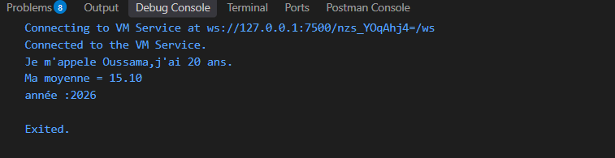
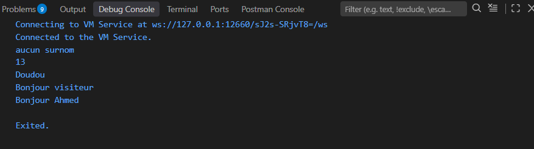
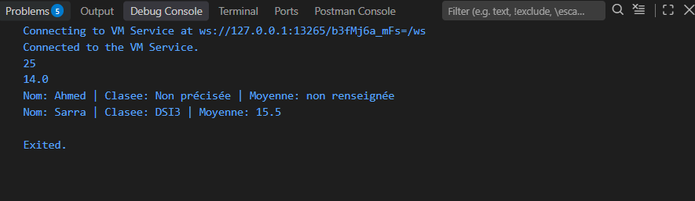
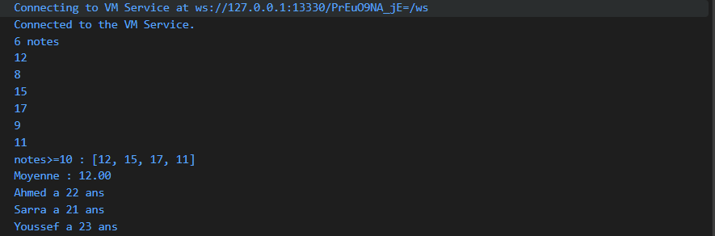
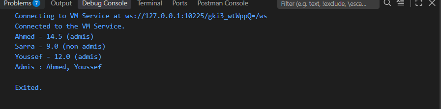
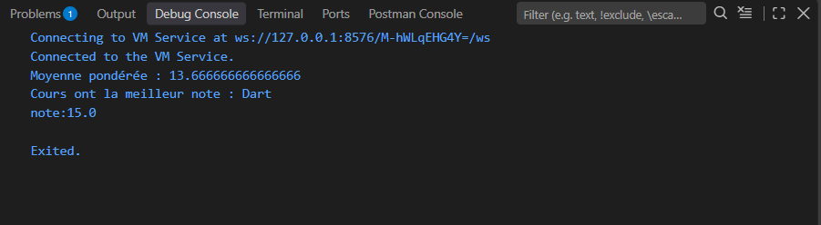

A sample command-line application with an entrypoint in `bin/`, library code
in `lib/`, and example unit test in `test/`.

Au TODO 5:
Finall recoit la valeur une seule fois
const est une valeur fixe.

Palier 2: 
-> Pour eviter les erreurs dans le programme.

Palier 3:
->parametre nommé rend lle code plus facile a comprendre

Palier 4:
-> list contient des elements, map contient des cles et des valeurs

Palier 5: 
->final empeche de modifier la valeur apres creation

Devoir S2:

